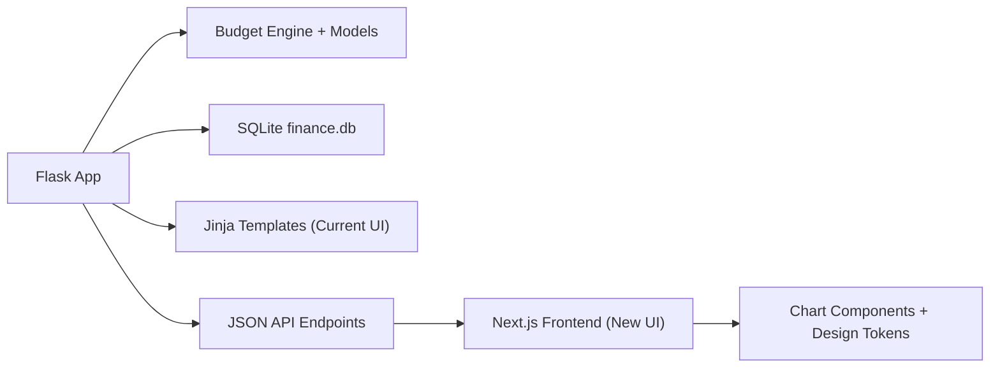

# Modern Frontend Map for FinTracker

## Objective

Keep Python and Flask for finance logic, data import, and storage while evolving the UI into a more modern React/Next experience. This is optimized for personal use, so the plan focuses on maintainability and visual quality instead of deployment process.

## Target Architecture

## Why Keep Python

- Existing financial logic in `budget_engine.py` and `models.py` is already the core value.
- Data operations are straightforward and local (SQLite), which is a strong fit for Flask.
- Frontend quality is mostly a UI layer concern, so visual modernization does not require backend language changes.

## Personal-Use Migration Sequence

### Phase A: Chart polish on current templates

- Keep current Flask templates in place.
- Improve chart color softness and readability hierarchy.
- Keep planned vs actual visual distinction consistent across charts.

### Phase B: Add high-value finance insights

- Spending pace line: actual burn vs ideal burn-to-date.
- End-of-period spending forecast: burn-rate estimate and confidence note.

### Phase C: Introduce Next.js shell

- Create a small Next.js frontend with shared chart primitives.
- Start with one page (`dashboard`) to prove parity and better UX.
- Continue using Flask endpoints as-is, then add `/api/v1` aliases for stability.

### Phase D: Migrate tracker and optional template retirement

- Migrate `tracker` page once dashboard parity is complete.
- Keep Flask as API/auth/session shell.
- Retire Jinja pages only when feature parity and confidence are high.

## Recommended Next Finance Chart Upgrades

1. Net cashflow trend
- Add a dedicated chart for `income - spending` by month or pay period.
- Benefit: immediate directional signal, not just raw totals.

2. Spending pace vs target pace
- Plot expected cumulative spend line for each current period.
- Benefit: easier in-period correction before overspending.

3. Savings benchmark markers
- Add expected-by-date markers for e-fund and Roth trajectories.
- Benefit: makes delay/slippage obvious without reading tables.

4. Category contribution labels
- Show top category percentages in chart tooltip and table rows.
- Benefit: faster decision-making on cut candidates.

5. Forecast card on tracker
- Add projected end-of-period spending and predicted over/under amount.
- Benefit: turns tracker into a forward-looking control panel.
